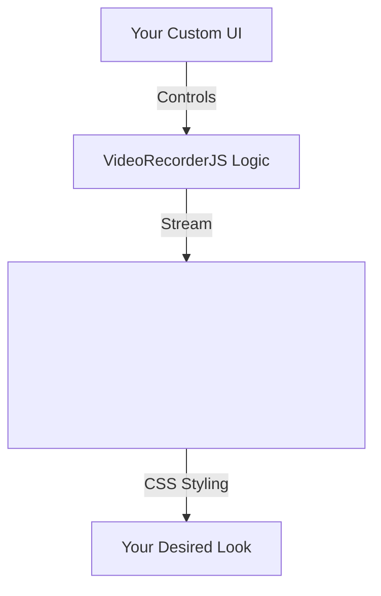

# 2.0.0 VideoRecorderJS


**VideoRecorderJS** is a modern, lightweight, and powerful JavaScript library for recording video, audio, and screen content directly in the browser.

## ✨ Features

- 🎥 **Camera Recording**: Capture video from webcam with audio.
- 🎨 **Headless Design**: 100% customizable UI. You control the styling.
- 💻 **Screen Recording**: Record screen, windows, or tabs (`getDisplayMedia`).
- 🔊 **Audio Visualization**: Built-in event hooks to easily visualize audio data.
- 🚀 **Modern API**: Promise-based, Event-driven, and ES Module ready.
- 📦 **Lightweight**: Zero dependencies.

> **Note**: Version 2.0.0 is a complete rewrite using modern Web APIs (`MediaRecorder`, `mediaDevices`). Support for legacy browsers (IE, etc.) has been dropped in favor of performance and standard compliance.


## 📦 Installation

```bash
npm install videorecorderjs
# or
yarn add videorecorderjs
```

## 🚀 Usage

### basic Example

```javascript
import { VideoRecorderJS } from 'videorecorderjs';

const recorder = new VideoRecorderJS({
    videotagid: 'my-video-element',
    videoWidth: 1280,
    videoHeight: 720,
    log: true
});

// Listen for events
recorder.on('stream-ready', (stream) => {
    console.log('Stream is ready to record');
});

recorder.on('stop', (result) => {
    // result contains { blob, url, type }
    const video = document.getElementById('my-video-element');
    video.src = result.url;
});

// Start Camera
await recorder.startCamera();

// Start Recording
recorder.startRecording();

// Stop after 5 seconds
setTimeout(() => {
    recorder.stopRecording();
}, 5000);
```

### Screen Recording

```javascript
await recorder.startScreen();
recorder.startRecording();
```

## 🛠 Configuration

| Option | Type | Default | Description |
| -- | -- | -- | -- |
| `videotagid` | `string` | **Required** | The ID of the `<video>` element to attach the stream to. |
| `videoWidth` | `number` | `640` | Ideal video width. |
| `videoHeight` | `number` | `480` | Ideal video height. |
| `framerate` | `number` | `30` | Desired frame rate. |
| `mimeType` | `string` | `video/webm` | The MIME type for recording (e.g., `video/mp4`). |
| `log` | `boolean` | `false` | Enable console logging. |

## 🎨 Styling & Customization

VideoRecorderJS is a **headless** library. This means it provides the *logic* but leaves the *UI* entirely up to you. This gives you maximum freedom to style your application.

### Understanding the Architecture



### How to Style

Since you provide the `<video>` element, you can style it using standard CSS:

```css
/* Example: Make the video look like a modern card */
#my-video-element {
    width: 100%;
    border-radius: 16px;
    box-shadow: 0 10px 30px rgba(0,0,0,0.2);
    object-fit: cover;
    background: #000;
}
```

You can overlay buttons, add custom controls, or build a complete studio interface around it (as seen in the screenshot above).

## 🗺 Roadmap

We are actively working on making VideoRecorderJS the de-facto standard. Here is what's coming next:

### v2.1.0 - Filters & Effects
- [ ] Real-time video filters (grayscale, sepia, blur background).
- [ ] Watermarking support.

### v2.2.0 - Advanced Audio
- [ ] Select specific audio input device (mic selection).
- [ ] Audio mixing (Mic + System Audio).

### v3.0.0 - AI Integration
- [ ] Browser-based background removal using TensorFlow.js.
- [ ] Speech-to-Text transcription hooks.

## 🤝 Contributing

Contributions are welcome! Please open an issue or submit a pull request.

## 📄 License

MIT © [Imal Hasaranga](https://github.com/imalhasaranga)
