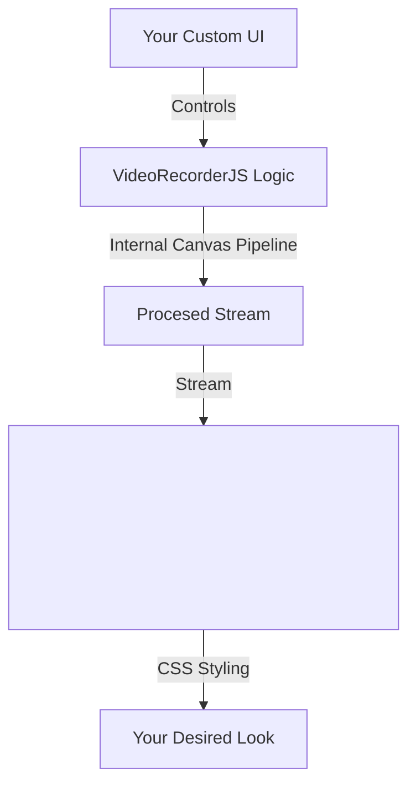

# 3.1.0 VideoRecorderJS


**VideoRecorderJS** is a modern, lightweight, and powerful JavaScript library for recording video, audio, and screen content directly in the browser.

## ✨ Features

- 🎥 **Camera Recording**: Capture video from webcam with audio.
- 🎨 **Filters & Effects**: Apply realtime filters (sepia, grayscale, blur) and watermarks.
- 🖼 **Canvas Processing**: Internal pipeline ensures effects are baked into the recording.
- 💻 **Screen Recording**: Record screen, windows, or tabs (`getDisplayMedia`).
- 🔊 **Audio Visualization**: Built-in event hooks to easily visualize audio data.
- 🚀 **Modern API**: Promise-based, Event-driven, and ES Module ready.
- 📦 **Lightweight**: Zero dependencies.

> **Note**: Version 3.1.0 introduces a Canvas-based processing pipeline. This enables real-time effects but is slightly more resource-intensive than raw stream recording.


## 📦 Installation

```bash
npm install videorecorderjs
# or
yarn add videorecorderjs
```

## 🚀 Usage

### Basic Example

```javascript
import VideoRecorderJS from 'videorecorderjs';

const recorder = new VideoRecorderJS({
    videoTagId: 'my-video-element', // Changed from videotagid
    videoWidth: 1280,
    videoHeight: 720,
    log: true
});

// ... listeners ...

// Start Camera (Async/Await recommended)
try {
    await recorder.startCamera();
} catch (error) {
    console.error("Camera access failed:", error);
}

// Start Recording
try {
    recorder.startRecording();
} catch (error) {
    console.error("Recording failed to start:", error);
}
```

### Filters & Watermarks (New in v3.1.0)

You can apply CSS-style filters and text watermarks dynamically. These effects are rendered onto the recorded video string.

```javascript
// Apply a filter (accepts standard Canvas 'filter' strings)
recorder.setFilter('grayscale(100%)'); 
recorder.setFilter('sepia(100%)');
recorder.setFilter('blur(5px)');
recorder.setFilter('none'); // Reset

// Add a Watermark (Top-Right, White text with background box)
recorder.setWatermark('Confidential - 2025');
recorder.setWatermark(null); // Remove
```

### Screen Recording

```javascript
try {
    await recorder.startScreen();
    // Filters work on Screen Share too!
    recorder.setWatermark('Screen Capture');
    recorder.startRecording();
} catch (error) {
    console.error("Screen recording failed:", error);
}
```

## 🛠 Configuration

| Option | Type | Default | Description |
| -- | -- | -- | -- |
| `videoTagId` | `string` or `HTMLElement` | **Required** | The ID or Element to attach the stream to. |
| `videoWidth` | `number` | `640` | Ideal video width. |
| `videoHeight` | `number` | `480` | Ideal video height. |
| `frameRate` | `number` | `30` | Desired frame rate. |
| `webpQuality` | `number` | `1.0` | Quality of WebP images (if used). |
| `mimeType` | `string` | `video/webm` | The MIME type for recording. |
| `log` | `boolean` | `false` | Enable console logging. |

## 🎨 Styling & Customization

VideoRecorderJS is a **headless** library. This means it provides the *logic* but leaves the *UI* entirely up to you. This gives you maximum freedom to style your application.

### Understanding the Architecture



### How to Style

Since you provide the `<video>` element, you can style it using standard CSS:

```css
/* Example: Make the video look like a modern card */
#my-video-element {
    width: 100%;
    border-radius: 16px;
    box-shadow: 0 10px 30px rgba(0,0,0,0.2);
    object-fit: contain; /* Recommended to prevent watermark cropping */
    background: #000;
}
```

You can overlay buttons, add custom controls, or build a complete studio interface around it (as seen in the screenshot above).

## 🗺 Roadmap

We are actively working on making VideoRecorderJS the de-facto standard. Here is what's coming next:

### v3.1.0 - Filters & Effects (Released)
- [x] Real-time video filters (grayscale, sepia, blur background).
- [x] Watermarking support.

### v3.2.0 - Advanced Audio
- [ ] Select specific audio input device (mic selection).
- [ ] Audio mixing (Mic + System Audio).

### v4.0.0 - AI Integration
- [ ] Browser-based background removal using TensorFlow.js.
- [ ] Speech-to-Text transcription hooks.

## 🤝 Contributing

Contributions are welcome! Please open an issue or submit a pull request.

## 📄 License

MIT © [Imal Hasaranga](https://github.com/imalhasaranga)
